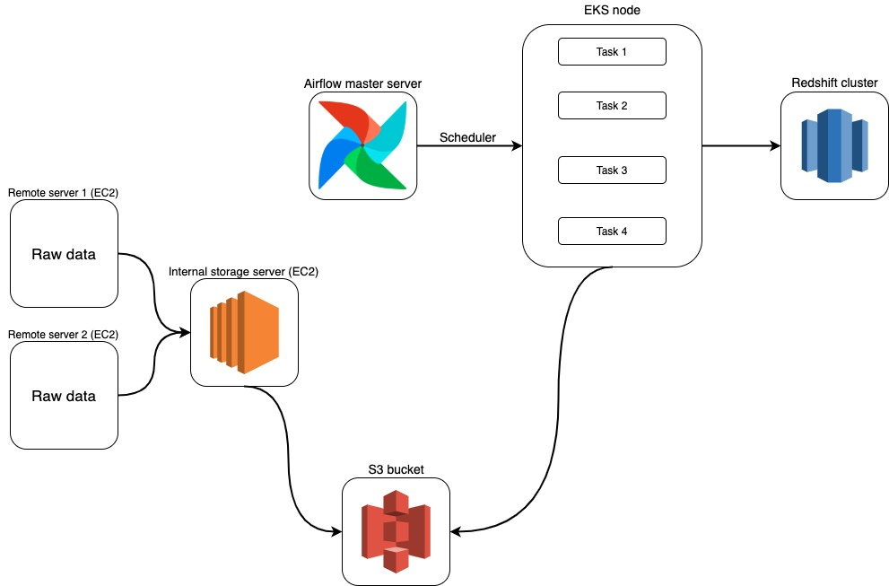

## Creating architecture of ETL process and its implementation

This README provides a basic description of this project

### Architecture

 

Data from remote server copying to local server [copy_from_remote_server.py](dags/utils/utils.py)
After copying we have to validate that all data delivered successfully. If it's true, we are loading data to S3 bucket. After loading we are submitting Saprk job in EMR cluster ([main.py](app/main.py)). Job calculates the metrics and loads it to Redshift cluster. Also Spark job creating Parquet files with sorted data.

### Infrastructure as Code
Work in progess...

### Configuration management
Work in progress...

### Technologies and tools

##### Infrastructure as Code

- Terraform (0.12.23)

##### Configuration management

- Ansible 

##### Data processing

- PySpark (2.4.4)

##### ETL workflow management

- Apache Airflow

##### Cloud

- AWS Elastic Compute Cloud (EC2)
- AWS Elastic MapReduce (EMR)
- AWS Simple Storage Service (S3)
- AWS Redshift
- AWS Elastic Kubernetes Service (EKS)
- AWS Elastic File System (EFS)
- AWS Relational Database Service (RDS)
   